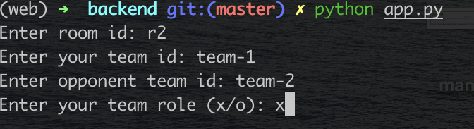
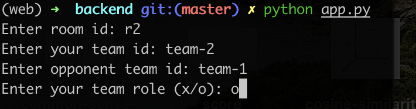

# Hướng dẫn chạy
1. Chạy trọng tài 
2. Lấy link trọng tài để chạy Backend và Frontend
3. Chạy Frontend 
4. Chạy Backend
5. Cách chạy cụ thể được hướng dẫn trong file README của referee, backend và frontend

# Cách chạy Backend

1. Vào thư mục /backend
2. cài đặt môi trường  `pip install -r requirements.txt`
3. Chạy `python app.py`
4. Điền thông tin phòng và 2 đội chơi

