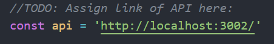
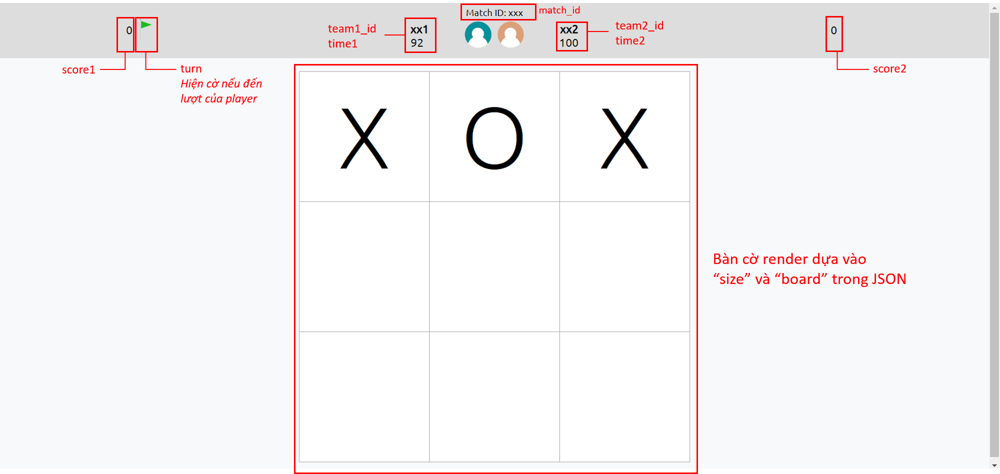

# Hướng dẫn sử dụng
<h3>Yêu cầu</h3>
<ul>
<li>Cần có Node.js v16.16.0 để chạy ứng dụng</li>
<li>Tải Node.js: <a href="https://nodejs.org/en/download">Link</a></li>
<li>Sử dụng terminal, cd đến thư mục <i>frontend</i> và chạy: <pre>npm install</pre>
</ul>

<h3>Hướng dẫn chạy</h3>
<ol>
<li>Mở file <i>frontend/public/script.js</i></li>
<li>Gán link API trọng tài cho biến <i>api</i> trong file <i>script.js</i></li>
</img>
<li>Chạy: <pre>npm start</pre>
<li>Nhập room_id, nếu khớp với room_id từ trọng tài, script sẽ fetch JSON từ API và re-render trang web mỗi 1 giây</li>
</ol>

<h3>Các thành phần của giao diện</h3>
</img>
