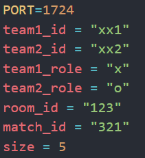

# Trọng tài
## Cách sử dụng:
1. Chạy câu lệnh `pip install -r requirements.txt` trong terminal để cài những thư viện cần thiết
2. Chạy `python app.py` để chạy trọng tài
3. Lấy địa chỉ trọng tài và các thông tin như sau để chạy Backend và Frontend:

    